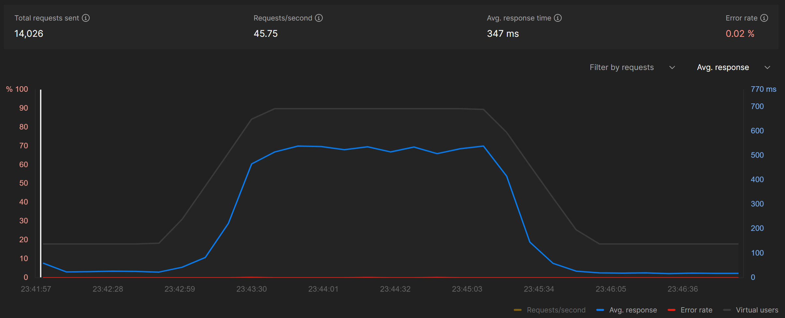

# НИЯУ МИФИ. Лабораторная работа №1 Георгий Шулындин, Б21-525. 2024

## Предметная область

Система для асинхронного построения облака слов

### Процесс взаимодействия

1) Пользователь отправляет текст для построения облака слов.
2) Сервис принимает запрос, сохраняет текст в базе данных и добавляет задачу на построение облака слов в брокер сообщений.
3) Воркер читает задачи из очереди, выполняет построение облака слов и сохраняет изображение облака слов в базу данных.
4) Пользователь может проверить статус задачи, используя уникальный идентификатор задачи. После завершения обработки пользователь получает ссылку для скачивания изображения облака слов.

### Параметры работы системы

- Стандартная интенсивность трафика составляет 25 RPS
- В периоды пиковых нагрузок интенсивность может достигать 100 RPS

### Технологический стек

- FastAPI - бэкенд
- PostgreSQL - СУБД
- Redis - брокер сообщений

Выбор Redis обусловлен его простой настройкой и способностью эффективно управлять очередями обработки без избыточной сложности.

## Развертывание


1. Поменять секретные значения в файле `.env`

2. Запустить контейнеры:
   ```bash
   docker-compose up -d --build
   ```

## Нагрузочное тестирование

### Принцип тестирования

Для проведения нагрузочного тестирования были использованы два сценария: единовременный всплеск активности и продолжительная нагрузка. Система успешно справилась с обоими видами тестирования.

### Результаты тестирования

Во время единовременного всплеска активности, который предполагал значительное превышение возможностей сервиса, система продемонстрировала стабильность и способность обрабатывать запросы без сбоев, несмотря на кратковременное превышение нагрузочных пиков.

При проведении теста на продолжительную нагрузку система функционировала без ошибок. Однако, когда количество пользователей достигло пика, время ответа увеличилось до 500 мс, что является довольно высоким показателем. Для уменьшения времени ответа планируется внедрение кэширования.



## Заключение

В рамках выполненной работы была успешно разработана система для асинхронного построения облака слов, состоящая из двух основных компонентов: API сервера и воркера для обработки задач. Для организации взаимодействия между компонентами был использован брокер сообщений Redis, что позволило значительно повысить надежность и пропускную способность системы. Эффективность данного подхода была подтверждена результатами нагрузочного тестирования. Несмотря на пиковую нагрузку в 100 запросов в секунду, система продемонстрировала стабильную работу без ошибок.
